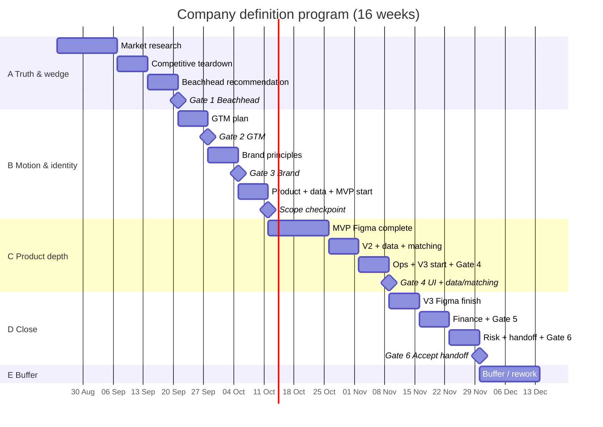

# 16-week program plan

> **Schedule and narrative.**  
> **Total:** 16 weeks = **14 weeks planned work** + **2 weeks buffer**.  
> **Canonical definition of done** = each phase’s [`docs/phases/*/README.md`](docs/phases/README.md).  
> **Week-by-week tasks** = [`PLAN-WEEKS.md`](PLAN-WEEKS.md).  
> **Stubs** = linked files below (already created — fill them, don’t recreate).

## How to use this doc

1. Read [CHARTER.md](CHARTER.md) once.  
2. Work from [PLAN-WEEKS.md](PLAN-WEEKS.md) day to day.  
3. Fill linked stubs; tick DoD in the **phase README**.  
4. Keep [STATUS.md](STATUS.md) current.  
5. If PLAN text and a phase README disagree → **phase README wins**; then fix PLAN.

---

## At a glance

| Block | Weeks | Focus | Exit |
| --- | --- | --- | --- |
| **A — Truth & wedge** | 1–4 | [01](docs/phases/01-market/) [02](docs/phases/02-competitive/) [03](docs/phases/03-beachhead/) | **Gate 1** — lock beachhead |
| **B — Motion & identity** | 5–7 | [04](docs/phases/04-gtm/) [05](docs/phases/05-brand/) [06](docs/phases/06-product/) [07](docs/phases/07-data-matching/) start | **Gate 2** · **Gate 3** · **Scope checkpoint** |
| **C — Product depth** | 8–11 | [06](docs/phases/06-product/) [07](docs/phases/07-data-matching/) [08](docs/phases/08-ops/) | **Gate 4** · **Ops checkpoint** |
| **D — Money, risk, handoff** | 12–14 | [06](docs/phases/06-product/) V3 · [09](docs/phases/09-finance/) [10](docs/phases/10-risk/) [11](docs/phases/11-handoff/) | **Gate 5** · **Gate 6** |
| **E — Buffer** | 15–16 | Rework only | Close gate feedback |

> **Real calendar:** [meetings/SCHEDULE.md](meetings/SCHEDULE.md) (program start/end, every weekly meeting, T-24, gate targets).  
> Gantt dates below are illustrative until SCHEDULE is filled at kickoff — then treat SCHEDULE as authoritative.

---

## Meeting cadence

Full detail: [meetings/README.md](meetings/README.md).

| Ritual | When | Purpose |
| --- | --- | --- |
| **Kickoff** | Before Week 1, **60 min max** | Align on charter, repo, tools, calendar |
| **Weekly working session** | Same weekday, **60 min max**; **Malte leads**. Only live meeting each week. | Informed discussion of findings; Daniel chooses among 2–3 prepared decisions. Gate locks happen here when due. |
| **T-24 pack** | 24h before weekly | All content in repo + agenda + decision options with pros/cons (+ gate brief on lock weeks) — see [meetings/README.md](meetings/README.md) |

---

## Block A — Weeks 1–4 (Truth & wedge)

### Weeks 1–2 — Market

| | Link |
| --- | --- |
| Phase DoD | [docs/phases/01-market/README.md](docs/phases/01-market/README.md) |
| Stub | [MARKET-BRIEF.md](docs/phases/01-market/MARKET-BRIEF.md) |
| Sources log | [SOURCES.md](docs/phases/01-market/SOURCES.md) |
| Starter list | [SOURCES-STARTER.md](docs/phases/01-market/SOURCES-STARTER.md) |

### Weeks 2–3 — Competitive

| | Link |
| --- | --- |
| Phase DoD | [docs/phases/02-competitive/README.md](docs/phases/02-competitive/README.md) |
| Stubs | [COMPETITOR-MATRIX.md](docs/phases/02-competitive/COMPETITOR-MATRIX.md) · [POSITIONING-DRAFT.md](docs/phases/02-competitive/POSITIONING-DRAFT.md) |
| Starter list | [COMPETITORS-STARTER.md](docs/phases/02-competitive/COMPETITORS-STARTER.md) |

### Weeks 3–4 — Beachhead

| | Link |
| --- | --- |
| Phase DoD | [docs/phases/03-beachhead/README.md](docs/phases/03-beachhead/README.md) |
| Stubs | [BEACHHEAD-RECOMMENDATION.md](docs/phases/03-beachhead/BEACHHEAD-RECOMMENDATION.md) · [SCORECARD.md](docs/phases/03-beachhead/SCORECARD.md) |

### Gate 1 — Lock beachhead

**Pack:** recommendation + scorecard + sources  
**Log:** [decisions/DECISION-LOG.md](decisions/DECISION-LOG.md)  
**Pass:** Daniel approves niche × geography.

---

## Block B — Weeks 5–7 (Motion & identity)

### Week 5 — GTM → Gate 2

| | Link |
| --- | --- |
| Phase DoD | [docs/phases/04-gtm/README.md](docs/phases/04-gtm/README.md) |
| Stub | [GTM-PLAN.md](docs/phases/04-gtm/GTM-PLAN.md) |

### Week 6 — Brand → Gate 3

| | Link |
| --- | --- |
| Phase DoD | [docs/phases/05-brand/README.md](docs/phases/05-brand/README.md) |
| Stub | [BRAND-PRINCIPLES.md](docs/phases/05-brand/BRAND-PRINCIPLES.md) |

### Week 7 — Product scope + data v0 + MVP Figma start → Scope checkpoint

| | Link |
| --- | --- |
| Product DoD | [docs/phases/06-product/README.md](docs/phases/06-product/README.md) |
| Product stubs | [PRODUCT-CONCEPT.md](docs/phases/06-product/PRODUCT-CONCEPT.md) · [FIGMA.md](docs/phases/06-product/FIGMA.md) · [MVP-SCREEN-INVENTORY.md](docs/phases/06-product/MVP-SCREEN-INVENTORY.md) *(seeded)* |
| Data DoD | [docs/phases/07-data-matching/README.md](docs/phases/07-data-matching/README.md) |
| Data stubs | [DATA-DICTIONARY.md](docs/phases/07-data-matching/DATA-DICTIONARY.md) *(seeded)* · [SEARCH-DIMENSIONS.md](docs/phases/07-data-matching/SEARCH-DIMENSIONS.md) *(seeded)* |

**Scope checkpoint (end of Week 7):** lock MVP/V2/V3 feature lists in decision log before polishing all screens. Same week: start MVP frames under brand principles.

---

## Block C — Weeks 8–11 (Product depth)

### Weeks 8–9 — MVP Figma complete

- Continue seeded [MVP-SCREEN-INVENTORY.md](docs/phases/06-product/MVP-SCREEN-INVENTORY.md) until every row has a Figma frame + states.

### Week 10 — V2 + data acquisition + matching draft

- [V2-SCREEN-INVENTORY.md](docs/phases/06-product/V2-SCREEN-INVENTORY.md)  
- [DATA-ACQUISITION.md](docs/phases/07-data-matching/DATA-ACQUISITION.md) *(seeded methods — deepen)*  
- Start [MATCHING-SPEC.md](docs/phases/07-data-matching/MATCHING-SPEC.md)

### Week 11 — Matching finish, ops, V3 start → Gate 4 + ops checkpoint

- Finish matching spec  
- [OPS-MODEL.md](docs/phases/08-ops/OPS-MODEL.md) · [HEADCOUNT-PLAN.md](docs/phases/08-ops/HEADCOUNT-PLAN.md)  
- Frame key V3 flows  
- [08-ops README](docs/phases/08-ops/README.md)

**Gate 4 pack:** Figma + inventories + data dictionary + acquisition + matching spec.  
**Pass:** Engineer can implement without a strategy workshop.

---

## Block D — Weeks 12–14 (Money, risk, handoff)

### Week 12 — V3 Figma finish

- [V3-SCREEN-INVENTORY.md](docs/phases/06-product/V3-SCREEN-INVENTORY.md) · [VERSION-MAP.md](docs/phases/06-product/VERSION-MAP.md)

### Week 13 — Finance → Gate 5

| | Link |
| --- | --- |
| Phase DoD | [docs/phases/09-finance/README.md](docs/phases/09-finance/README.md) |
| Narrative | [FINANCIAL-MODEL.md](docs/phases/09-finance/FINANCIAL-MODEL.md) |
| Milestones | [MILESTONE-PROJECTIONS.md](docs/phases/09-finance/MILESTONE-PROJECTIONS.md) |
| Sheet structure | [MODEL-OUTLINE.md](docs/phases/09-finance/MODEL-OUTLINE.md) |

### Week 14 — Risk + handoff → Gate 6

| | Link |
| --- | --- |
| Risk DoD | [docs/phases/10-risk/README.md](docs/phases/10-risk/README.md) |
| Risk stubs | [RISK-REGISTER.md](docs/phases/10-risk/RISK-REGISTER.md) · [COMPLIANCE-BRIEF.md](docs/phases/10-risk/COMPLIANCE-BRIEF.md) · [ASSUMPTIONS.md](docs/phases/10-risk/ASSUMPTIONS.md) · [KILL-CRITERIA.md](docs/phases/10-risk/KILL-CRITERIA.md) |
| Handoff DoD | [docs/phases/11-handoff/README.md](docs/phases/11-handoff/README.md) |
| Handoff stubs | [HANDOFF-CHECKLIST.md](docs/phases/11-handoff/HANDOFF-CHECKLIST.md) · [SYSTEM-CONTEXT.md](docs/phases/11-handoff/SYSTEM-CONTEXT.md) · [BUILD-CONSTRAINTS.md](docs/phases/11-handoff/BUILD-CONSTRAINTS.md) · [OPEN-QUESTIONS-FOR-ENG.md](docs/phases/11-handoff/OPEN-QUESTIONS-FOR-ENG.md) |

---

## Block E — Weeks 15–16 (Buffer)

**Allowed:** gate rework, citations, Figma polish, finance sensitivities, handoff clarity.  
**Not allowed:** new niche / versions / scope without decision log + Daniel approval.

---

## Deliverable index

| Artifact | Stub | Phase DoD |
| --- | --- | --- |
| Market brief | [MARKET-BRIEF.md](docs/phases/01-market/MARKET-BRIEF.md) | [01 README](docs/phases/01-market/README.md) |
| Competitor matrix | [COMPETITOR-MATRIX.md](docs/phases/02-competitive/COMPETITOR-MATRIX.md) | [02 README](docs/phases/02-competitive/README.md) |
| Beachhead | [BEACHHEAD-RECOMMENDATION.md](docs/phases/03-beachhead/BEACHHEAD-RECOMMENDATION.md) | [03 README](docs/phases/03-beachhead/README.md) |
| GTM plan | [GTM-PLAN.md](docs/phases/04-gtm/GTM-PLAN.md) | [04 README](docs/phases/04-gtm/README.md) |
| Brand principles | [BRAND-PRINCIPLES.md](docs/phases/05-brand/BRAND-PRINCIPLES.md) | [05 README](docs/phases/05-brand/README.md) |
| Product concept | [PRODUCT-CONCEPT.md](docs/phases/06-product/PRODUCT-CONCEPT.md) | [06 README](docs/phases/06-product/README.md) |
| Figma index | [FIGMA.md](docs/phases/06-product/FIGMA.md) | same |
| MVP / V2 / V3 inventories | [MVP](docs/phases/06-product/MVP-SCREEN-INVENTORY.md) · [V2](docs/phases/06-product/V2-SCREEN-INVENTORY.md) · [V3](docs/phases/06-product/V3-SCREEN-INVENTORY.md) | same |
| Data dictionary | [DATA-DICTIONARY.md](docs/phases/07-data-matching/DATA-DICTIONARY.md) | [07 README](docs/phases/07-data-matching/README.md) |
| Data acquisition | [DATA-ACQUISITION.md](docs/phases/07-data-matching/DATA-ACQUISITION.md) | same |
| Matching spec | [MATCHING-SPEC.md](docs/phases/07-data-matching/MATCHING-SPEC.md) | same |
| Ops / headcount | [OPS-MODEL.md](docs/phases/08-ops/OPS-MODEL.md) · [HEADCOUNT-PLAN.md](docs/phases/08-ops/HEADCOUNT-PLAN.md) | [08 README](docs/phases/08-ops/README.md) |
| Finance | [FINANCIAL-MODEL.md](docs/phases/09-finance/FINANCIAL-MODEL.md) · [MODEL-OUTLINE.md](docs/phases/09-finance/MODEL-OUTLINE.md) | [09 README](docs/phases/09-finance/README.md) |
| Risk pack | [10-risk/](docs/phases/10-risk/) | [10 README](docs/phases/10-risk/README.md) |
| Handoff | [11-handoff/](docs/phases/11-handoff/) | [11 README](docs/phases/11-handoff/README.md) |
| Decisions | [DECISION-LOG.md](decisions/DECISION-LOG.md) | — |
| Week checklist | [PLAN-WEEKS.md](PLAN-WEEKS.md) | — |
