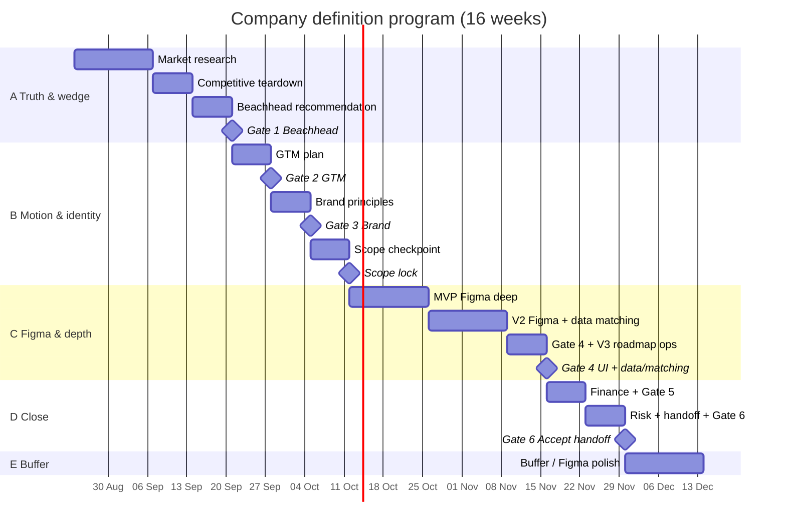

# 16-week program plan

> **Schedule and narrative.**  
> **Total:** 16 weeks = **14 weeks planned work** + **2 weeks buffer**.  
> **Primary work product:** each phase [`WORKSHEET.md`](docs/phases/WORKSHEET-GUIDE.md) (progress) plus [`tasks/`](docs/phases/README.md) (inspiration).  
> **Week checklist:** [`PLAN-WEEKS.md`](PLAN-WEEKS.md) (points at task IDs like `05-T3`).  
> Stubs in phase folders are optional evidence only.

## How to use this doc

1. Read [CHARTER.md](CHARTER.md) and [docs/phases/WORKSHEET-GUIDE.md](docs/phases/WORKSHEET-GUIDE.md) once.  
2. Work from [PLAN-WEEKS.md](PLAN-WEEKS.md) day to day (task IDs).  
3. Track progress on the phase **WORKSHEET.md**; read **`tasks/`** for context; link your notes.  
4. Keep [STATUS.md](STATUS.md) current.  
5. If anything conflicts → **WORKSHEET-GUIDE + worksheet** win (task files are inspiration, not a second assignment); then fix PLAN.

---

## At a glance

| Block | Weeks | Focus | Exit |
| --- | --- | --- | --- |
| **A — Truth & wedge** | 1–4 | [01](docs/phases/01-market/) [02](docs/phases/02-competitive/) [03](docs/phases/03-beachhead/) | **Gate 1** — lock beachhead |
| **B — Motion & identity** | 5–7 | [04](docs/phases/04-gtm/) [05](docs/phases/05-brand/) [06](docs/phases/06-product/) scope · [07](docs/phases/07-data-matching/) v0 | **Gate 2** · **Gate 3** · **Scope checkpoint** |
| **C — Figma & product depth** | 8–12 | [06](docs/phases/06-product/) Figma · [07](docs/phases/07-data-matching/) · [08](docs/phases/08-ops/) | **Gate 4** · **Ops checkpoint** |
| **D — Money, risk, handoff** | 13–14 | [09](docs/phases/09-finance/) [10](docs/phases/10-risk/) [11](docs/phases/11-handoff/) | **Gate 5** · **Gate 6** |
| **E — Buffer** | 15–16 | Figma polish, sensitivities, rework | Close gate feedback |

**Rebalance note:** Figma gets **Weeks 8–11 as primary work** (~70% Malte time). Data, ops, and finance run in parallel or compress so screens are build-ready at Gate 4.

> **Real calendar:** [meetings/SCHEDULE.md](meetings/SCHEDULE.md) (program start/end, every weekly meeting, T-24, gate targets).  
> Gantt dates below are illustrative until SCHEDULE is filled at kickoff — then treat SCHEDULE as authoritative.

---

## Meeting cadence

Full detail: [meetings/README.md](meetings/README.md).

| Ritual | When | Purpose |
| --- | --- | --- |
| **Kickoff** | Before Week 1, **60 min max** | Align on charter, repo, tools, calendar |
| **Weekly working session** | Same weekday, **60 min max**; **Malte leads**. Only live meeting each week. | Informed discussion of findings; Daniel chooses among 2–3 prepared decisions. Gate locks happen here when due. |
| **T-24 pack** | 24h before weekly | All content in repo + agenda + decision options with pros/cons (+ gate brief on lock weeks) — see [meetings/README.md](meetings/README.md) |

---

## Block A — Weeks 1–4 (Truth & wedge)

### Weeks 1–2 — Market

| | Link |
| --- | --- |
| Phase DoD | [docs/phases/01-market/README.md](docs/phases/01-market/README.md) |
| Task briefs | [tasks/](docs/phases/01-market/tasks/README.md) (`01-T1` market functions … `01-T5`) |
| Rolling risk | Append flags to [RISK-REGISTER.md](docs/phases/10-risk/RISK-REGISTER.md) from Week 1 |

### Weeks 2–3 — Competitive

| | Link |
| --- | --- |
| Phase DoD | [docs/phases/02-competitive/README.md](docs/phases/02-competitive/README.md) |
| Stubs | [COMPETITOR-MATRIX.md](docs/phases/02-competitive/COMPETITOR-MATRIX.md) · [POSITIONING-DRAFT.md](docs/phases/02-competitive/POSITIONING-DRAFT.md) |

### Weeks 3–4 — Beachhead

| | Link |
| --- | --- |
| Phase DoD | [docs/phases/03-beachhead/README.md](docs/phases/03-beachhead/README.md) |
| Stubs | [BEACHHEAD-RECOMMENDATION.md](docs/phases/03-beachhead/BEACHHEAD-RECOMMENDATION.md) · [SCORECARD.md](docs/phases/03-beachhead/SCORECARD.md) |

### Gate 1 — Lock beachhead

**Pack:** recommendation + scorecard + sources + validation plan if conditions  
**Log:** [decisions/DECISION-LOG.md](decisions/DECISION-LOG.md)  
**Pass:** Daniel approves niche × geography.

---

## Block B — Weeks 5–7 (Motion & identity)

### Week 5 — GTM → Gate 2

| | Link |
| --- | --- |
| Phase DoD | [docs/phases/04-gtm/README.md](docs/phases/04-gtm/README.md) |
| Metrics stub | [METRICS-MAP.md](docs/phases/04-gtm/METRICS-MAP.md) |
| Finance prep | Draft who-pays / billable-event hypotheses (feeds Phase 09) |

### Week 6 — Brand → Gate 3

| | Link |
| --- | --- |
| Phase DoD | [docs/phases/05-brand/README.md](docs/phases/05-brand/README.md) |
| Stub | [BRAND-PRINCIPLES.md](docs/phases/05-brand/BRAND-PRINCIPLES.md) |

### Week 7 — Scope pivot → Scope checkpoint (no Figma)

| | Link |
| --- | --- |
| Product DoD | [docs/phases/06-product/README.md](docs/phases/06-product/README.md) |
| Data DoD | [docs/phases/07-data-matching/README.md](docs/phases/07-data-matching/README.md) |

**Scope checkpoint (end of Week 7):** lock MVP/V2/V3 feature lists + dictionary v0 (beachhead-critical fields). **Do not start Figma frames** until scope locks — Figma begins Week 8 under brand principles.

---

## Block C — Weeks 8–12 (Figma & product depth)

### Weeks 8–9 — MVP Figma (primary focus)

- Every row in [MVP-SCREEN-INVENTORY.md](docs/phases/06-product/MVP-SCREEN-INVENTORY.md) → Figma frame + states + annotations.
- Malte time: ~70% Figma; light parallel work on beachhead-critical search dimensions only.

### Weeks 10–11 — V2 Figma + data/matching depth

- [V2-SCREEN-INVENTORY.md](docs/phases/06-product/V2-SCREEN-INVENTORY.md) — complete to same standard as MVP  
- [DATA-ACQUISITION.md](docs/phases/07-data-matching/DATA-ACQUISITION.md) · [MATCHING-SPEC.md](docs/phases/07-data-matching/MATCHING-SPEC.md)  
- Week 10: dictionary ↔ Figma sync checkpoint  
- Week 11: [08-T1 supply](docs/phases/08-ops/tasks/08-T1-SUPPLY-APPROACHES.md) (required)

### Week 12 — Gate 4 + V3 roadmap + ops checkpoint

- V3 **roadmap** Figma (directional key flows — polish in buffer Weeks 15–16)  
- Ops checkpoint: [OPS-MODEL.md](docs/phases/08-ops/OPS-MODEL.md) · [HEADCOUNT-PLAN.md](docs/phases/08-ops/HEADCOUNT-PLAN.md)  
- Finance spreadsheet skeleton ([09-T1](docs/phases/09-finance/tasks/09-T1-WHO-PAYS.md)–[09-T3](docs/phases/09-finance/tasks/09-T3-SPREADSHEET.md))  
- Start handoff index ([11-T1](docs/phases/11-handoff/tasks/11-T1-HANDOFF-INDEX.md))

**Gate 4 pack:** MVP + V2 Figma (build-ready) · V3 Figma (roadmap) · inventories · data dictionary · acquisition · matching spec · notifications/comms spec  
**Pass:** Engineer can implement **MVP (+ gated V2)** without a strategy workshop. V3 is directional, not build-blocking.

---

## Block D — Weeks 13–14 (Money, risk, handoff)

### Week 13 — Finance → Gate 5

| | Link |
| --- | --- |
| Phase DoD | [docs/phases/09-finance/README.md](docs/phases/09-finance/README.md) |
| Narrative | [FINANCIAL-MODEL.md](docs/phases/09-finance/FINANCIAL-MODEL.md) |
| Milestones | [MILESTONE-PROJECTIONS.md](docs/phases/09-finance/MILESTONE-PROJECTIONS.md) |

Unit economics, milestone projections, narrative, Gate 5. Sensitivities ([09-T6](docs/phases/09-finance/tasks/09-T6-SENSITIVITIES.md)) here if model is clean; else buffer.

### Week 14 — Risk synthesis + handoff → Gate 6

| | Link |
| --- | --- |
| Risk DoD | [docs/phases/10-risk/README.md](docs/phases/10-risk/README.md) |
| Handoff DoD | [docs/phases/11-handoff/README.md](docs/phases/11-handoff/README.md) |

Phase 10 **synthesizes** the rolling [RISK-REGISTER.md](docs/phases/10-risk/RISK-REGISTER.md) and Phase 07 privacy flags — not first-time discovery.

---

## Block E — Weeks 15–16 (Buffer)

**Allowed:** Figma polish (MVP/V2 states, V3 depth), gate rework, finance sensitivities, handoff clarity.  
**Not allowed:** new niche / versions / scope without decision log + Daniel approval.

---

## Deliverable index

| Phase | Guided worksheet (primary) |
| --- | --- |
| 01 Market | [WORKSHEET.md](docs/phases/01-market/WORKSHEET.md) · [task briefs](docs/phases/01-market/tasks/README.md) |
| 02 Competitive | [WORKSHEET.md](docs/phases/02-competitive/WORKSHEET.md) · [task briefs](docs/phases/02-competitive/tasks/README.md) |
| 03 Beachhead | [WORKSHEET.md](docs/phases/03-beachhead/WORKSHEET.md) · [task briefs](docs/phases/03-beachhead/tasks/README.md) |
| 04 GTM | [WORKSHEET.md](docs/phases/04-gtm/WORKSHEET.md) · [task briefs](docs/phases/04-gtm/tasks/README.md) · [METRICS-MAP.md](docs/phases/04-gtm/METRICS-MAP.md) |
| 05 Brand | [WORKSHEET.md](docs/phases/05-brand/WORKSHEET.md) |
| 06 Product | [WORKSHEET.md](docs/phases/06-product/WORKSHEET.md) |
| 07 Data & matching | [WORKSHEET.md](docs/phases/07-data-matching/WORKSHEET.md) |
| 08 Ops | [WORKSHEET.md](docs/phases/08-ops/WORKSHEET.md) |
| 09 Finance | [WORKSHEET.md](docs/phases/09-finance/WORKSHEET.md) |
| 10 Risk | [WORKSHEET.md](docs/phases/10-risk/WORKSHEET.md) |
| 11 Handoff | [WORKSHEET.md](docs/phases/11-handoff/WORKSHEET.md) |
| How to use | [WORKSHEET-GUIDE.md](docs/phases/WORKSHEET-GUIDE.md) |
| Week checklist | [PLAN-WEEKS.md](PLAN-WEEKS.md) |
| Decisions | [DECISION-LOG.md](decisions/DECISION-LOG.md) |
